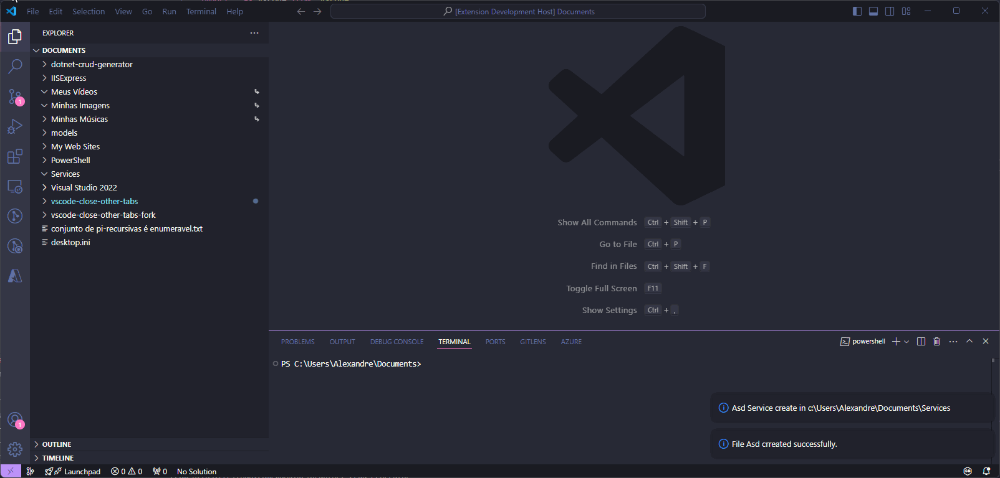
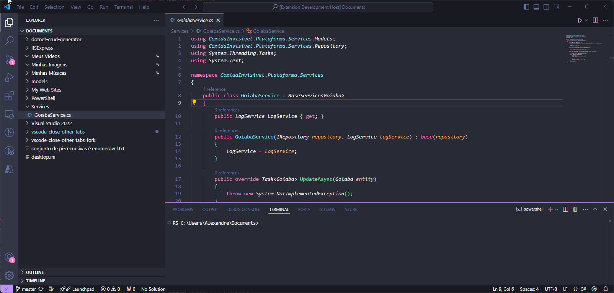

# .NET CRUD Generator
### Automate the creation of a CRUD following the standards of your .NET project.

# Templates
### Configure templates with whatever initial code you want.

# TODO

- [x] Publish the extension
- [ ] Being able to choose which models will be created in the settings tab.
- [x] create unit tests
- [x] create a command to reset the default files.

